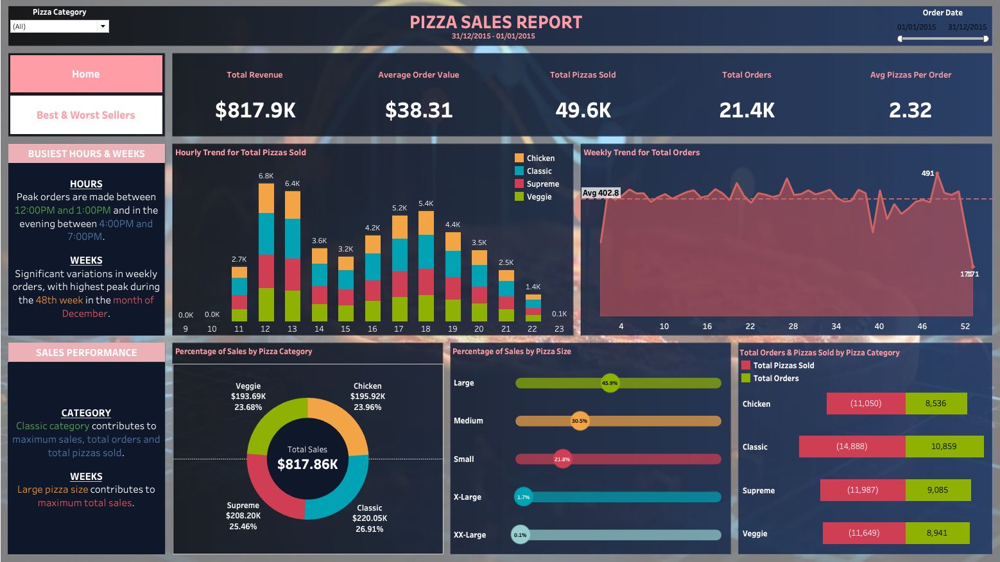
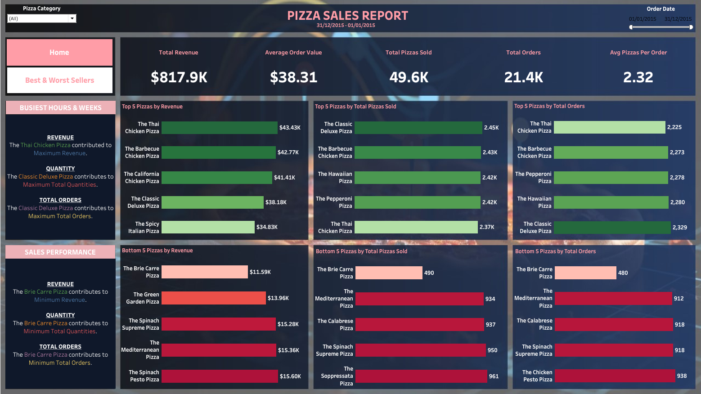

# Pizza Sales Report

This is my attempt on the [Tableau & SQL Project by Data Tutorials](https://youtu.be/lrl0vz-p-yc?si=pMjJB8zYsUmDsdK4).
Data Tutorials is a channel on YouTube dedicated to Data Analysis, that provides in-depth tutorials to master tools like Power BI, Tableau, SQL, Excel, Python, AWS, Azure and more.

## Table of Contents

- [The tutorial](#the-tutorial)
- [Screenshot](#screenshot)
- [Links](#links)
- [Built with](#built-with)
- [What I learned](#what-i-learned)
- [Continued development](#continued-development)
- [Useful resources](#useful-resources)
- [Author](#author)

### The tutorial

By the end of the tutorial, you should be able to: extract, transform and load data using SQL queries. You should also be able to analyse and visualise data using Tableau.

### Screenshot




### Links

- Tableau Public URL: [Tableau Public](https://public.tableau.com/views/PizzaSalesReport_16954141158890/Home?:language=en-GB&:display_count=n&:origin=viz_share_link)

### Built with

- SQL
- Azure Data Studio
- Tableau

### What I learned

In this tutorial, I learnt how to use SQL queries, a tool I have not used off the platform that I learnt the language, Codecademy. Here is a snippet of some of the code:

```sql
-- Hourly Trend for Total Pizzas Sold
SELECT DATEPART(Hour, order_time) as order_hours, SUM(quantity) as total_pizzas_sold
FROM pizza_sales
group by DATEPART(Hour, order_time)
order by DATEPART(Hour, order_time)
```

```sql
-- Total Pizzas Sold by Pizza Category
SELECT pizza_category, SUM(quantity) as Total_Quantity_Sold
FROM pizza_sales
WHERE MONTH(order_date) = 2
GROUP BY pizza_category
ORDER BY Total_Quantity_Sold DESC
```

### Continued development

To continue developing my data analytics skills, I would like to learn more SQL queries, and to attempt a project that includes Python.

## Author

- Nneoma Eronini - [@omathestudio](https://public.tableau.com/app/profile/nneoma.eronini)
